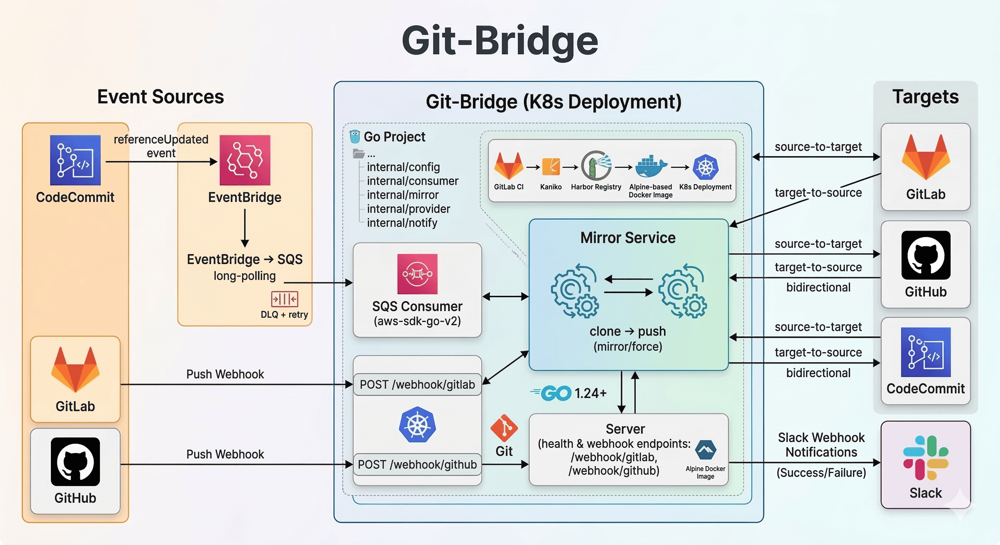

# Git-Bridge

[](https://github.com/somaz94/git-bridge)

Multi-provider, bidirectional Git repository mirroring tool.

Supports CodeCommit, GitLab, GitHub with any-to-any mirroring via SQS polling and webhook receivers.

<br/>

## Architecture

```
                         Event Sources                          Git-Bridge                    Targets
                    ┌──────────────────────┐            ┌──────────────────┐
                    │                      │            │                  │
 ┌──────────────┐   │  EventBridge → SQS   │──(poll)──▶│                  │──▶ GitLab
 │  CodeCommit  │──▶│  (referenceUpdated)  │           │                  │
 └──────────────┘   │         + DLQ        │           │                  │──▶ GitHub
                    └──────────────────────┘           │    Mirror Svc    │
                                                       │                  │──▶ CodeCommit
 ┌──────────────┐   ┌──────────────────────┐           │  clone → push   │
 │    GitLab    │──▶│  POST /webhook/gitlab│──(http)──▶│                  │──▶ ...
 └──────────────┘   └──────────────────────┘           │                  │
                                                       │                  │
 ┌──────────────┐   ┌──────────────────────┐           │                  │       ┌───────┐
 │    GitHub    │──▶│  POST /webhook/github│──(http)──▶│                  │──────▶│ Slack │
 └──────────────┘   └──────────────────────┘           │                  │       └───────┘
                                                       └──────────────────┘
```

<br/>

<p align="center">
  
</p>

<br/>

### Event Flow

| Source Provider | Event Delivery | Trigger |
|-----------------|---------------|---------|
| **CodeCommit** | EventBridge → SQS → long-polling | `referenceUpdated` event |
| **GitLab** | Push Webhook → `POST /webhook/gitlab` | Push event |
| **GitHub** | Push Webhook → `POST /webhook/github` | Push event |

<br/>

## Features

- **Multi-provider**: CodeCommit, GitLab, GitHub (extensible via `Provider` interface)
- **Any-to-any**: Any provider can mirror to any other provider
- **Multi-repo**: Configure multiple repositories in a single instance
- **Bidirectional**: `source-to-target` / `target-to-source` / `bidirectional`
- **Loop detection**: Skips notification on no-op push (already up-to-date), preventing redundant alerts in bidirectional sync
- **Multi-SQS consumer**: Support multiple SQS queues for multi-AWS region/account environments
- **Dual event sources**: SQS polling (CodeCommit) + HTTP webhooks (GitLab/GitHub)
- **DLQ support**: Failed SQS messages retry up to 5 times, then move to DLQ
- **Notifications**: Slack webhook on success/failure (see [Slack App Setup](docs/slack-app-setup.md))
- **Cloud-native**: K8s Deployment with liveness/readiness probes

<br/>

## Tech Stack

- **Language**: Go 1.24+
- **AWS SDK**: aws-sdk-go-v2 (SQS consumer)
- **Git**: `git clone --mirror` / `git push --mirror --force`
- **Config**: YAML with `${ENV_VAR}` expansion (credentials only; repos defined directly)
- **CI/CD**: GitHub Actions (test, release, changelog)
- **Runtime**: Kubernetes (Alpine-based Docker image)

<br/>

## Project Structure

```
git-bridge/
├── cmd/git-bridge/         # Entry point
├── internal/
│   ├── config/             # YAML config with env var expansion
│   ├── consumer/
│   │   ├── sqs.go          # SQS consumer (CodeCommit events via EventBridge)
│   │   └── webhook.go      # HTTP webhook consumer (GitLab/GitHub push events)
│   ├── mirror/             # Git mirror operations (clone/push, direction-aware)
│   ├── provider/           # Git provider abstraction (CodeCommit, GitLab, GitHub)
│   ├── notify/             # Slack webhook notifications
│   └── server/             # HTTP server (health + webhook endpoints)
├── k8s/                    # Kubernetes manifests (production, minimal comments)
│   ├── namespace.yaml
│   ├── secret.yaml         # Credentials only (tokens, keys, passwords)
│   ├── registry-secret.yaml
│   ├── configmap.yaml      # config.yaml (repos defined directly, credentials via ${ENV_VAR})
│   └── deployment.yaml     # Deployment + Service + Ingress
├── examples/               # Example files with detailed comments
│   ├── config.yaml         # App config example
│   ├── secret.yaml         # K8s Secret example (placeholder values)
│   ├── configmap.yaml      # K8s ConfigMap example
│   └── deployment.yaml     # K8s Deployment + Service + Ingress example
├── .github/workflows/      # GitHub Actions (test, release, changelog, etc.)
├── cliff.toml              # git-cliff changelog configuration
├── Makefile                # Build, test, deploy commands
└── Dockerfile              # Multi-stage build (golang → alpine)
```

<br/>

## Configuration

Credentials are injected via environment variables (`${VAR}` syntax, expanded at startup). Repository definitions are written directly in the ConfigMap — no env vars needed for repos.

> All env vars follow the `<TYPE>_<NAME>_<FIELD>` pattern. See [docs/naming-convention.md](docs/naming-convention.md) for the full naming convention guide.
>
> Example files with detailed comments are available in the [examples/](examples/) directory. Use them as a starting point for your own configuration.

<br/>

### Environment Variables (K8s Secret)

| Variable | Description | Required |
|----------|-------------|----------|
| `CODECOMMIT_<NAME>_REGION` | AWS region per CodeCommit provider (e.g. `CODECOMMIT_EU_REGION`) | Yes* |
| `CODECOMMIT_<NAME>_GIT_USERNAME` | CodeCommit HTTPS Git username (e.g. `CODECOMMIT_EU_GIT_USERNAME`) | Yes* |
| `CODECOMMIT_<NAME>_GIT_PASSWORD` | CodeCommit HTTPS Git password (e.g. `CODECOMMIT_EU_GIT_PASSWORD`) | Yes* |
| `GITLAB_<NAME>_BASE_URL` | GitLab instance URL (e.g. `GITLAB_MAIN_BASE_URL`) | Yes* |
| `GITLAB_<NAME>_TOKEN` | GitLab personal access token (e.g. `GITLAB_MAIN_TOKEN`) | Yes* |
| `GITHUB_<NAME>_TOKEN` | GitHub personal access token (e.g. `GITHUB_MAIN_TOKEN`) | Yes* |
| `SQS_<NAME>_QUEUE_URL` | SQS queue URL per consumer (e.g. `SQS_EU_QUEUE_URL`) | Yes** |
| `SQS_<NAME>_REGION` | SQS region per consumer (e.g. `SQS_EU_REGION`) | Yes** |
| `SQS_<NAME>_ACCESS_KEY` | AWS access key per consumer (e.g. `SQS_EU_ACCESS_KEY`) | Yes** |
| `SQS_<NAME>_SECRET_KEY` | AWS secret key per consumer (e.g. `SQS_EU_SECRET_KEY`) | Yes** |
| `WEBHOOK_GITLAB_SECRET` | X-Gitlab-Token verification (empty = skip) | No |
| `WEBHOOK_GITHUB_SECRET` | GitHub webhook secret for HMAC-SHA256 (empty = skip) | No |
| `SLACK_WEBHOOK_URL` | Slack incoming webhook URL (empty = disabled) | No |
| `CONFIG_PATH` | Config file path (default: `/etc/git-bridge/config.yaml`) | No |
| `WORK_DIR` | Temp directory for git operations (default: `/tmp/git-bridge`) | No |

> \* Required per provider. Follow the `<TYPE>_<NAME>_<FIELD>` pattern. `<NAME>` is a free-form identifier — e.g. `EU`/`US` for AWS services, `MAIN`/`SECONDARY` for platform services.
> \** Required per SQS consumer. Follow the `SQS_<NAME>_*` pattern — e.g. `SQS_EU_*`, `SQS_US_*`, `SQS_AP_*`

<br/>

### Repository Config (ConfigMap)

Repos are defined directly in `k8s/configmap.yaml` under the `repos:` section. No environment variables or Secret changes needed — just add a new entry:

```yaml
repos:
  - name: my-new-repo
    source: codecommit-eu
    target: gitlab-main
    source_path: my-new-repo
    target_path: server/my-new-repo
    direction: source-to-target
```

<br/>

### Mirror Direction

| Direction | Description | Trigger | Example |
|-----------|-------------|---------|---------|
| `source-to-target` | Source → Target only | SQS (CodeCommit) or source webhook | CodeCommit → GitLab |
| `target-to-source` | Target → Source only | Target provider webhook **required** | GitLab → CodeCommit |
| `bidirectional` | Both directions | SQS + target webhook **both required** | CodeCommit ↔ GitLab |

> **Note**: `target-to-source` and `bidirectional` require webhook configuration on the target provider (GitLab/GitHub).
> If using only `source-to-target` with CodeCommit as source, SQS (EventBridge) triggers automatically — no webhook setup needed.
>
> See [docs/ADVANCE.md](docs/ADVANCE.md) for all provider combinations and detailed configuration examples.

<br/>

## Endpoints

| Path | Method | Description |
|------|--------|-------------|
| `/health` | GET | Liveness probe |
| `/ready` | GET | Readiness probe |
| `/webhook/gitlab` | POST | GitLab push event receiver |
| `/webhook/github` | POST | GitHub push event receiver |

> See [docs/API.md](docs/API.md) for detailed request/response specifications.

<br/>

## Build

```bash
# Build binary
make build

# Run tests
make test

# Format & vet
make fmt vet

# Docker build
make docker-build
```

<br/>

## Deploy

<br/>

### Kubernetes

```bash
# 1. Create namespace
kubectl apply -f k8s/namespace.yaml

# 2. Create secrets (edit secret.yaml values first!)
kubectl apply -f k8s/registry-secret.yaml
kubectl apply -f k8s/secret.yaml

# 3. Create configmap and deployment
kubectl apply -f k8s/configmap.yaml
kubectl apply -f k8s/deployment.yaml

# Verify
kubectl get pods -n git-bridge
kubectl logs -n git-bridge -l app=git-bridge -f
```

<br/>

### Useful Commands

```bash
make restart   # Restart deployment
make logs      # Tail pod logs
make deploy    # Apply all k8s manifests
```

<br/>

## Setting Up Webhooks

> Webhook setup is **required** when direction is `target-to-source` or `bidirectional`.
> If using only `source-to-target` with CodeCommit as source, SQS triggers automatically — no webhook needed.

<br/>

### GitLab Webhook

Configure individually for each target GitLab project. See [docs/gitlab-webhook-setup.md](docs/gitlab-webhook-setup.md) for detailed setup guide.

1. Go to GitLab project > Settings > Webhooks
2. URL: `http://git-bridge.example.com/webhook/gitlab`
3. Secret token: (match `WEBHOOK_GITLAB_SECRET`)
4. Trigger: Push events
5. Enable SSL verification: No (HTTP)

<br/>

### GitHub Webhook

Configure individually for each target GitHub repository. See [docs/github-webhook-setup.md](docs/github-webhook-setup.md) for detailed setup guide.

1. Go to GitHub repo > Settings > Webhooks > Add webhook
2. Payload URL: `http://git-bridge.example.com/webhook/github`
3. Content type: `application/json`
4. Secret: (match `WEBHOOK_GITHUB_SECRET`)
5. Events: Just the push event

<br/>

## Adding a New Repository

1. Add the repo entry to `k8s/configmap.yaml` under `repos:`:

```yaml
- name: new-repo
  source: codecommit-eu
  target: gitlab-main
  source_path: new-repo
  target_path: server/new-repo
  direction: source-to-target
```

2. If using CodeCommit with EventBridge → SQS, add the repo name to your Terraform configuration.

3. Apply and restart:

```bash
kubectl apply -f k8s/configmap.yaml
kubectl rollout restart -n git-bridge deployment/git-bridge
```

> No changes to `secret.yaml` or `deployment.yaml` are needed.
> If direction is `target-to-source` or `bidirectional`, webhook setup is also required on the target provider (GitLab/GitHub) project. See [Setting Up Webhooks](#setting-up-webhooks).

<br/>

## Adding a New Provider

Implement the `Provider` interface in `internal/provider/`:

```go
type Provider interface {
    CloneURL(repoPath string) string
    Type() string
}
```

Register it in `provider.New()`.

<br/>

## Documentation

| Document | Description |
|----------|-------------|
| [Naming Convention](docs/naming-convention.md) | Multi-provider naming convention guide |
| [Advanced Config](docs/ADVANCE.md) | All provider combinations and detailed examples |
| [API Reference](docs/API.md) | Endpoint request/response specifications |
| [GitLab Webhook](docs/gitlab-webhook-setup.md) | GitLab webhook setup guide |
| [GitHub Webhook](docs/github-webhook-setup.md) | GitHub webhook setup guide |
| [Slack App Setup](docs/slack-app-setup.md) | Slack notification setup guide |

<br/>

## Contributing

Issues and pull requests are welcome.

<br/>

## License

This project is licensed under the Apache License 2.0 - see the [LICENSE](LICENSE) file for details.

<br/>

## Contributors

Thanks to all contributors:

<a href="https://github.com/somaz94/git-bridge/graphs/contributors">
  
</a>

---

## Star History
<picture>
   <source media="(prefers-color-scheme: dark)" srcset="https://api.star-history.com/svg?repos=somaz94/git-bridge&type=date&theme=dark&legend=top-left" />
   <source media="(prefers-color-scheme: light)" srcset="https://api.star-history.com/svg?repos=somaz94/git-bridge&type=date&legend=top-left" />
   
</picture>
