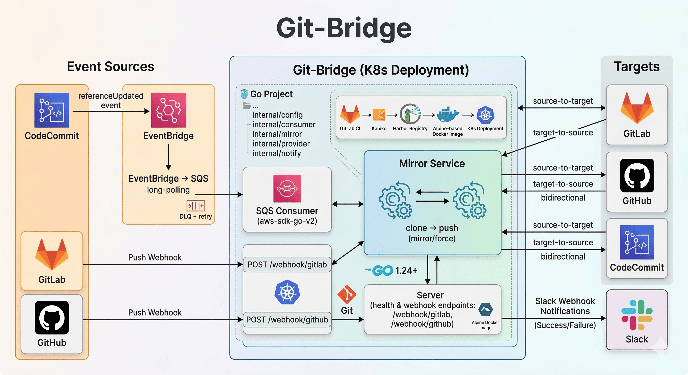

# Git-Bridge

[](https://github.com/somaz94/git-bridge)

Multi-provider, bidirectional Git repository mirroring tool.

Supports CodeCommit, GitLab, GitHub with any-to-any mirroring via SQS polling and webhook receivers.

<br/>

## Architecture

```
                         Event Sources                          Git-Bridge                    Targets
                    ┌──────────────────────┐            ┌──────────────────┐
                    │                      │            │                  │
 ┌──────────────┐   │  EventBridge → SQS   │──(poll)──▶ │                  │──▶ GitLab
 │  CodeCommit  │──▶│  (referenceUpdated)  │            │                  │
 └──────────────┘   │         + DLQ        │            │                  │──▶ GitHub
                    └──────────────────────┘            │    Mirror Svc    │
                                                        │                  │──▶ CodeCommit
 ┌──────────────┐   ┌──────────────────────┐            │  clone → push    │
 │    GitLab    │──▶│  POST /webhook/gitlab│──(http)──▶ │                  │──▶ ...
 └──────────────┘   └──────────────────────┘            │                  │
                                                        │                  │
 ┌──────────────┐   ┌──────────────────────┐            │                  │       ┌───────┐
 │    GitHub    │──▶│  POST /webhook/github│──(http)──▶ │                  │──────▶│ Slack │
 └──────────────┘   └──────────────────────┘            │                  │       └───────┘
                                                        └──────────────────┘
```

<br/>

<p align="center">
  
</p>

<br/>

### Event Flow

| Source Provider | Event Delivery | Trigger |
|-----------------|---------------|---------|
| **CodeCommit** | EventBridge → SQS → long-polling | `referenceUpdated` event |
| **GitLab** | Push Webhook → `POST /webhook/gitlab` | Push event |
| **GitHub** | Push Webhook → `POST /webhook/github` | Push event |

<br/>

## Features

- **Multi-provider**: CodeCommit, GitLab, GitHub (extensible via `Provider` interface)
- **Any-to-any**: Any provider can mirror to any other provider
- **Multi-repo**: Configure multiple repositories in a single instance
- **Bidirectional**: `source-to-target` / `target-to-source` / `bidirectional`
- **Delete propagation**: A branch/tag deletion on one side propagates to the other (CodeCommit ↔ GitLab/GitHub). Idempotent handling breaks the echo-delete loop.
- **Loop detection**: Skips notification on no-op push (already up-to-date), preventing redundant alerts in bidirectional sync
- **Multi-SQS consumer**: Support multiple SQS queues for multi-AWS region/account environments
- **Dual event sources**: SQS polling (CodeCommit) + HTTP webhooks (GitLab/GitHub)
- **DLQ support**: Failed SQS messages retry up to 5 times, then move to DLQ
- **Notifications**: Slack webhook on success/failure with committer info (see [Slack App Setup](docs/slack-app-setup.md))
- **Incremental sync**: Reuses existing mirror via `git fetch` — full clone only on first run or fallback
- **Persistent cache**: PVC-backed mirror directory survives pod restarts for fast recovery
- **Cloud-native**: K8s Deployment with liveness/readiness probes

<br/>

## Tech Stack

- **Language**: Go 1.26+
- **AWS SDK**: aws-sdk-go-v2 (SQS consumer)
- **Git**: Incremental `git fetch --prune` (with `git clone --mirror` fallback) / `git push --force`
- **Config**: YAML with `${ENV_VAR}` expansion (credentials only; repos defined directly)
- **CI/CD**: GitHub Actions (test, release, changelog)
- **Runtime**: Kubernetes (Alpine-based Docker image)

<br/>

## Project Structure

```
git-bridge/
├── cmd/git-bridge/         # Entry point
├── internal/
│   ├── config/             # YAML config with env var expansion
│   ├── consumer/
│   │   ├── sqs.go          # SQS consumer (CodeCommit events via EventBridge)
│   │   └── webhook.go      # HTTP webhook consumer (GitLab/GitHub push events)
│   ├── mirror/             # Git mirror operations (incremental fetch/clone, push, direction-aware)
│   ├── provider/           # Git provider abstraction (CodeCommit, GitLab, GitHub)
│   ├── notify/             # Slack webhook notifications
│   └── server/             # HTTP server (health + webhook endpoints)
├── k8s/                    # Kubernetes manifests (production, minimal comments)
│   ├── namespace.yaml
│   ├── secret.yaml         # Credentials only (tokens, keys, passwords)
│   ├── configmap.yaml      # config.yaml (repos defined directly, credentials via ${ENV_VAR})
│   ├── pvc.yaml            # PersistentVolumeClaim for mirror cache (optional)
│   └── deployment.yaml     # Deployment + Service + Ingress
├── examples/               # Example files with detailed comments
│   ├── config.yaml         # App config example
│   ├── secret.yaml         # K8s Secret example (placeholder values)
│   ├── configmap.yaml      # K8s ConfigMap example
│   └── deployment.yaml     # K8s Deployment + Service + Ingress example
├── .github/workflows/      # GitHub Actions (test, release, changelog, etc.)
├── cliff.toml              # git-cliff changelog configuration
├── Makefile                # Build, test, deploy commands
└── Dockerfile              # Multi-stage build (golang → alpine)
```

<br/>

## Configuration

Credentials are injected via environment variables (`${VAR}` syntax, expanded at startup). Repository definitions are written directly in the ConfigMap — no env vars needed for repos.

> All env vars follow the `<TYPE>_<NAME>_<FIELD>` pattern. See [docs/naming-convention.md](docs/naming-convention.md) for the full naming convention guide.
>
> Example files with detailed comments are available in the [examples/](examples/) directory. Use them as a starting point for your own configuration.

<br/>

### Environment Variables (K8s Secret)

| Variable | Description | Required |
|----------|-------------|----------|
| `CODECOMMIT_<NAME>_REGION` | AWS region per CodeCommit provider (e.g. `CODECOMMIT_EU_REGION`) | Yes* |
| `CODECOMMIT_<NAME>_GIT_USERNAME` | CodeCommit HTTPS Git username (e.g. `CODECOMMIT_EU_GIT_USERNAME`) | Yes* |
| `CODECOMMIT_<NAME>_GIT_PASSWORD` | CodeCommit HTTPS Git password (e.g. `CODECOMMIT_EU_GIT_PASSWORD`) | Yes* |
| `GITLAB_<NAME>_BASE_URL` | GitLab instance URL (e.g. `GITLAB_MAIN_BASE_URL`) | Yes* |
| `GITLAB_<NAME>_TOKEN` | GitLab personal access token (e.g. `GITLAB_MAIN_TOKEN`) | Yes* |
| `GITHUB_<NAME>_TOKEN` | GitHub personal access token (e.g. `GITHUB_MAIN_TOKEN`) | Yes* |
| `SQS_<NAME>_QUEUE_URL` | SQS queue URL per consumer (e.g. `SQS_EU_QUEUE_URL`) | Yes** |
| `SQS_<NAME>_REGION` | SQS region per consumer (e.g. `SQS_EU_REGION`) | Yes** |
| `SQS_<NAME>_ACCESS_KEY` | AWS access key per consumer (e.g. `SQS_EU_ACCESS_KEY`) | Yes** |
| `SQS_<NAME>_SECRET_KEY` | AWS secret key per consumer (e.g. `SQS_EU_SECRET_KEY`) | Yes** |
| `WEBHOOK_GITLAB_SECRET` | X-Gitlab-Token verification (empty = skip) | No |
| `WEBHOOK_GITHUB_SECRET` | GitHub webhook secret for HMAC-SHA256 (empty = skip) | No |
| `SLACK_WEBHOOK_URL` | Slack incoming webhook URL (empty = disabled) | No |
| `CONFIG_PATH` | Config file path (default: `/etc/git-bridge/config.yaml`) | No |
| `WORK_DIR` | Temp directory for git operations (default: `/tmp/git-bridge`) | No |

> \* Required per provider. Follow the `<TYPE>_<NAME>_<FIELD>` pattern. `<NAME>` is a free-form identifier — e.g. `EU`/`US` for AWS services, `MAIN`/`SECONDARY` for platform services.
> \** Required per SQS consumer. Follow the `SQS_<NAME>_*` pattern — e.g. `SQS_EU_*`, `SQS_US_*`, `SQS_AP_*`

<br/>

### Repository Config (ConfigMap)

Repos are defined directly in `k8s/configmap.yaml` under the `repos:` section. No environment variables or Secret changes needed — just add a new entry:

```yaml
repos:
  - name: my-new-repo
    source: codecommit-eu
    target: gitlab-main
    source_path: my-new-repo
    target_path: server/my-new-repo
    direction: source-to-target
```

<br/>

### Mirror Direction

| Direction | Description | Trigger | Example |
|-----------|-------------|---------|---------|
| `source-to-target` | Source → Target only | SQS (CodeCommit) or source webhook | CodeCommit → GitLab |
| `target-to-source` | Target → Source only | Target provider webhook **required** | GitLab → CodeCommit |
| `bidirectional` | Both directions | SQS + target webhook **both required** | CodeCommit ↔ GitLab |

> **Note**: `target-to-source` and `bidirectional` require webhook configuration on the target provider (GitLab/GitHub).
> If using only `source-to-target` with CodeCommit as source, SQS (EventBridge) triggers automatically — no webhook setup needed.
>
> See [docs/ADVANCE.md](docs/ADVANCE.md) for all provider combinations and detailed configuration examples.

<br/>

### Delete Propagation (branches/tags)

Deleting a branch/tag on one side deletes it on the other. The mirror would otherwise propagate only pushes and leave deletes behind, accumulating orphan refs on one side.

- **CodeCommit → target**: EventBridge `referenceDeleted` → SQS → ref deleted on the target (GitLab/GitHub).
- **target → CodeCommit**: GitLab/GitHub have no dedicated delete webhook event, so the delete is detected from the push payload — GitLab sends a zero-SHA `after`, GitHub sends `deleted: true`. **No extra webhook configuration is needed** (the push events you already receive are enough).
- **Idempotent handling**: Before deleting, `git ls-remote` reads the ref's tip on the destination; if the ref is already gone, the operation ends as a successful no-op. This auto-terminates the bidirectional delete loop ("delete A → delete B → B's delete event echoes back to A") on one leg.
- **The discarded tip is recorded**: that same `ls-remote` returns the SHA the ref pointed at, and it is written to the history event (`deleted_tip`) and the Slack message before the delete runs. A delete is the one operation that leaves nothing behind to look up — afterwards the destination names neither the ref nor the commit — so this is the only surviving handle on what was removed. The console shows it with a `git fetch <clone-url> <sha>` recovery line, the same way it does for an overwritten tip. git keeps the objects until it garbage-collects, so the window is real but not indefinite.
- **A recorded tip can be put back**: because `deleted_tip` survives, the console offers a restore button on that row instead of only printing the two commands to run by hand. The restore only ever fills a hole it can still see — if the ref is back on the destination it refuses (`ref-exists`) rather than overwrite, and if git has already collected the commit it fails as `object-gone`. Once the ref is re-created the mirror propagates it to the other side like any other push. See [Console](#console-separate-port).
- **There is deliberately no equivalent for a forced update.** There the ref still exists and points at something newer, so pushing the old tip back would destroy whatever legitimately landed in the meantime. A delete leaves a hole that can be filled; an overwrite leaves a decision, which is why that case still offers the `git fetch` alone.
- When a `ref_overrides` entry matches, a delete propagates **only in the allowed direction** (just like a push); a reverse-direction delete is silently skipped — protecting the authoritative side.

<br/>

### Per-ref Direction Pinning (ref_overrides)

In a `bidirectional` repo you can **pin specific refs (branches/tags) to a single direction**. When one side is the clear authority for a branch, this structurally prevents the other side's stale push or accidental delete from overwriting the authoritative copy. The repo as a whole stays bidirectional.

```yaml
repos:
  - name: my-repo
    source: codecommit-eu
    target: gitlab-main
    direction: bidirectional          # repo stays bidirectional
    ref_overrides:
      - { pattern: "release",   from: gitlab-main, to: codecommit-eu }
      - { pattern: "release-*", from: gitlab-main, to: codecommit-eu }
```

- `pattern`: ref short-name glob (`path.Match`). `*` does not cross `/` (`release/*` matches only `release/x`).
- `from` / `to`: the allowed direction's source/destination provider names. (Provider names are used directly instead of source/target labels to avoid direction confusion.)

**Behavior**:
- For a matched ref, **events in the opposite direction (push and delete) are silently skipped** (the SQS message is still deleted, so no retries / DLQ).
- A push is **scoped to the ref the event named**. When an event carries a ref (`meta.Ref != ""`), only that single ref is pushed — **whether or not** the repo declares `ref_overrides`. If that ref does not exist locally the push is skipped as `no-refs-to-push` rather than failing (this guards a retry for a branch that was deleted, and a fetch↔push prune race).
- An event with no ref (a full sync, or the hourly reconcile cron) pushes everything (`--all`) for a repo **without** `ref_overrides`, and every local ref minus the ones excluded for this direction for a repo **with** them.
- If ref enumeration (`ListRefs`) fails it is fail-open — the mirror does not stop; it falls back to the full `--all` push.

> **Why this is not gated on `ref_overrides`**: gating it that way destroyed a commit on 2026-08-10. A `demo-repo` event for `version/4.2.0` pushed every ref because the repo declares no overrides, and it force-wrote `master-b` from a source that had not yet seen a commit pushed there 49 seconds earlier. An event names the ref it is about; pushing anything else is the mirror acting on state it was not told about. Refs that never get their own event are still reconciled by the hourly cron, which sends no ref and therefore still pushes everything.

> **Validation rules**: `from`/`to` must be this repo's source and target, and must differ. For a one-way repo the pinned direction must match the repo direction, and duplicate `pattern`s are rejected.

<br/>

## Endpoints

| Path | Method | Description |
|------|--------|-------------|
| `/health` | GET | Liveness probe |
| `/ready` | GET | Readiness probe |
| `/api-docs` | GET | Swagger UI (API docs) |
| `/openapi.json` | GET | OpenAPI spec (kept in sync with routes by a unit test) |
| `/webhook/gitlab` | POST | GitLab push event receiver |
| `/webhook/github` | POST | GitHub push event receiver |
| `/retry/mirror` | POST | Manual mirror retry (requires `Authorization: Bearer <RETRY_API_TOKEN>`) |

> See [docs/API.md](docs/API.md) for detailed request/response specifications.

### Console (separate port)

The console is served on **its own listener** (`server.console_port`, default 8081), never on the public port. The public route only forwards to `server.port`, so the console is unreachable from outside the cluster and only a reverse-proxy portal attaches to this port.

The two ports use **separate muxes**. The console handlers are simply not registered on the public mux, and that is the entire guard — which is why nothing a client can forge, such as a header or the `Host` value, takes part in the decision: the socket that accepted the connection is the only thing that decides. On the public port the paths below answer **404, not 403**, because a public caller has no need to learn that the console exists.

| Path | Method | Description |
|------|--------|-------------|
| `/` | GET | Console page (recent mirror activity) |
| `/console/api/history` | GET | Recent events as JSON (`limit`, `failures=true`, `forced=true`, `repo=<name>`, `source=<trigger>`, `hide_routine=true`) |
| `/console/api/retry` | POST | Re-sync one repository (`{"repo": "...", "to": "..."}`). `to` is the destination endpoint of the row being re-run; the server turns that side into the direction that writes it. An explicit `direction` beats it, and with neither the request falls back to `auto`. `409` when `to` is not a side of that repo, or names a direction the repo's `direction` forbids |
| `/console/api/restore` | POST | Re-create a ref a delete removed (`{"repo": "...", "to": "...", "ref": "refs/heads/x", "sha": "<40-char>"}`). Synchronous; `409` when refused |
| `/console/api/force` | POST | Apply a rewind the push guard withheld (`{"repo": "...", "to": "...", "ref": "refs/heads/x", "dest": "<40-char>"}`). `dest` is the tip you are overwriting and becomes the push's lease; `409` when no matching hold is recorded |
| `/console/api/me` | GET | The viewer the portal authenticated, plus the docs link and which write routes are wired in (`user` / `name` / `email` / `groups` / `api_docs_url` / `restore_enabled` / `force_enabled`) |

> `console_port` and the deployment's `containerPort` / Service port have to move **together**. Changing only one either closes the console or opens it on the public port.

> 🛑 **The console has no authentication of its own.** It trusts the `X-Auth-*` headers a front proxy sets, and is safe only because nothing but that proxy can reach its port. The shipped manifests therefore expose **only** `server.port`; do not add a Service or `containerPort` for `console_port` unless an authenticating proxy sits in front of it, or you will publish an unauthenticated page carrying retry, restore and force-push buttons. To look at it locally, port-forward instead:
>
> ```bash
> kubectl -n git-bridge port-forward deploy/git-bridge 8081:8081
> # then open http://localhost:8081/
> ```

What the console does:

- **Filter by repository, failures only, row count** — the repository list in the dropdown comes from the history, so it never offers an option that returns nothing.
- **Expandable rows** — clicking a row shows the route, ref and duration along with the **full stderr of the git command that failed**.
- **Echo collapsing** — one real push always produces two events: the sync, and the echo from the other side. Events sharing a repository, ref and action within a two-minute window collapse into `+N echo`.
- **Mirror-loop detection** — three or more pushes that actually moved the same ref inside that window highlight the group and are counted at the top. An echo that does not settle after one round is what a loop looks like. Only `ok` counts: every real push already produces one `ok` plus a `skip` echo reporting there was nothing left to do, so counting the skip would flag two ordinary pushes to the same branch — and that skip is the evidence the echo terminated, not that it looped. Deliberate triggers (cron reconcile, manual retry) are excluded for the same reason.
- **Forced-update detection** — a push that moves a ref non-fast-forward discards commits at the destination. Those rows are marked in red, and expanding one shows **the tip that was discarded and the command to recover it**. The push itself succeeded, so the result stays `ok` and the failures filter never surfaces it — hence a separate **forced updates only** filter. Slack is alerted only when a branch was overwritten; a tag is recorded but stays quiet, because a pipeline that reuses build tag names re-points them constantly and an alert that fires on routine traffic is one people learn to ignore.
- **Re-run a sync** — expanding a row offers a button that re-syncs that repository after a confirmation. Useful for recovering from a failure, and for making one repository catch up without waiting for the hourly reconcile. The button re-runs **the direction that row records**, because it sends the row's destination endpoint along and the server resolves that side into a direction. It used to send `auto`, which on a bidirectional repo always resolves through `retry_direction` (`target-to-source`) — so clicking it on a row that failed `source-to-target` re-ran the other leg, whose destination was already ahead and could therefore only skip, leaving the real gap until the hourly reconcile. The label and the confirmation both name the side being written. Inside a collapsed group the button follows the **failed** event, not the head: the head is the echo coming back the other way, so following it would re-run the leg that already worked.
- **Restore a deleted ref** — a delete row that recorded a `deleted_tip` carries a red **Restore this ref** button, which re-creates the ref at that tip after a confirmation naming the repository, the destination and the commit. It is a separate button from retry, and red, because this one writes to a repository rather than re-running a sync. The restore is attributed: the portal's `X-Auth-User` becomes the event's `actor` and appears in the Slack message. Restoring propagates — the destination's own push event then carries the ref to the other side.
- **Apply a withheld rewind** — a row the push guard withheld lists each held ref with the destination tip that stopped the write, and carries a red **Apply rewind of `<ref>`** button per ref. The confirmation names the commit that will be discarded rather than asking "are you sure", because that commit is the decision. The server re-checks the hold against the history before acting, so a press arriving after the two sides converged on their own is refused (`409`) instead of overwriting something. Attributed the same way a restore is. One button moves one ref — a force is never repo-wide.
- **Who is viewing · API docs** — the header carries a `Hello, <name>` greeting and an `API docs` link. The wording is meant to match the portal a reader clicks through from: being addressed two different ways on two consecutive screens reads as two different systems. The display name falls back `name → user → email`, since an SSO account with no first/last name has an empty display name. The values come from the `X-Auth-User` / `X-Auth-Name` / `X-Auth-Email` / `X-Auth-Groups` headers it sets when proxying. What makes those trustworthy is the listener they arrive on: only the portal reaches the console port, and the portal overwrites any header a client sent under those names. Reached without the portal — a port-forward while debugging — the values are empty and the label stays hidden.

> 🔑 **Retrying never puts an API token in the browser.** The console asks the server, and **the server calls the mirror service itself**. `RETRY_API_TOKEN` stays inside the pod, and the portal session (login plus group check) is the only credential involved. Such a retry is recorded as `source: console`, which distinguishes it from the hourly reconcile (`cron`).

> 🛑 **A restore never overwrites.** The server re-reads the destination with `ls-remote` and refuses (`409`, reason `ref-exists`) if the ref came back, because between the row being rendered and the button being pressed someone may have re-created that branch — and overwriting it would be the same accident the feature exists to undo, with a different victim. The push that follows uses `--force-with-lease=<ref>:` (an empty expect means "this ref must not exist"), so even the window between the check and the write is closed by the remote atomically. A plain non-force push was not enough: non-force only rejects non-fast-forward updates, so a branch someone re-created at an **ancestor** of the restored commit would have been silently advanced onto it. A restore also passes the same gates every other write does — it is refused for a side the repo's `direction` never writes to, or a direction a `ref_override` pins away from — and it proceeds only when the history still records that delete (`no-matching-delete`). Restoring the same tip twice is a no-op skip, not an error, and a commit git has already garbage-collected fails as `object-gone` — the mirror cache is tried first, then a direct fetch from the other side. Unlike retry, which answers `202` and reports later, the route is synchronous: the refusal is the interesting outcome and has to reach the person who clicked.

> 🛑 **A restore does not queue behind a mirror.** It is the only mirror operation that runs inside an HTTP request, so waiting for the lock would hold the connection for the length of whatever fetch is in flight. A held lock is refused immediately as `503 repo-busy`; pressing the button again once the sync lands is the whole recovery. Every response also carries a machine-readable `reason` beside the human `error`, so a refusal (the guard worked — go look at what changed on the destination) reads differently from a breakage (the service could not do its job) without parsing prose.

<br/>

## Mirror History

Every completed mirror operation is appended as one line to a JSONL file on the volume. The mirror cache is disposable — it can always be re-cloned — and the history is not, so the two live in **separate directories**.

| Item | Value |
|------|-------|
| Location | `<work-dir>/.history/events.jsonl` (default `/tmp/git-bridge/.history/`) |
| Format | One JSONL line per event |
| Rotation | Rotated to `.1` past 10MB, keeping **two generations** (20MB on disk at most) |
| In memory | The newest 5000 events in a ring buffer — the console reads that, the file stays the record. The hourly reconcile is the noisiest producer, so a 500-entry ring was spent in five days (a webhook failure from last week had already been pushed out by routine no-ops); 5000 restores a ~50 day window |
| Restart | The tail of the file is re-read at startup to refill the ring buffer |

One event looks like this:

```json
{
  "ts": "2026-07-28T04:12:33Z",
  "repo": "test-repo",
  "action": "mirror",
  "source": "webhook",
  "from": "gitlab/team/test-repo",
  "to": "codecommit/test-repo",
  "ref": "refs/tags/v1.0.0",
  "result": "skip",
  "reason": "already-up-to-date",
  "duration_ms": 812
}
```

- `action` — `mirror` (branch/tag sync), `delete` (ref delete propagation) or `restore` (a console click putting back what a delete removed). A restore is its own action rather than a mirror because nothing upstream asked for it — a person did.
- `source` — `webhook` / `sqs` / `cron` (the reconcile CronJob) / `retry-api` (a hand-run call) / `console`.
- `result` — `ok` / `skip` / `fail`. Failures also carry `err`.
- `reason` — narrows `result`. A skip is not one thing (`already-up-to-date` / `ref-override` / `no-refs-to-push` / `already-absent`), and without this field those are indistinguishable in the log. It also narrows a success: `forced-update` means the push itself worked, but at least one ref was overwritten non-fast-forward, so whatever lived only on the tip it replaced is gone from the destination. A refused restore names why: `ref-exists` (the ref came back, so re-creating it would overwrite whoever put it there) or `object-gone` (git collected the commit); `create-ref` is a restore that failed at the push itself.
- `deleted_tip` — on a `delete` that actually removed something, the SHA the ref pointed at, read just before the delete ran. Absent everywhere else, including a delete that found the ref already gone. It exists because a delete leaves nothing behind to look up, so this is the only record of what was discarded.
- `restored_tip` — on a `restore` that actually re-created the ref, the SHA it was put back at. The counterpart to `deleted_tip`: the two events together tell the whole story of a ref that went away and came back, without anyone having to correlate them by timestamp.
- `actor` — who a console-driven action is attributed to, read from the portal's `X-Auth-User` header. Set only for actions a person triggers, because those are the only ones with a person behind them — a webhook or an SQS event has a pusher, not an operator. A restore writes to a real repository, so "who did this" has to survive in the record rather than only in whoever happened to be watching the channel.
- `duration_ms` — includes waiting for the per-repo lock. The duration in the Slack message starts after the lock and differs on purpose: Slack answers "how long did this sync take", the history answers "how long did this event take to be dealt with".

Recording history never fails a mirror operation. By the time a line is written the mirror has already succeeded or failed on its own, and losing an audit line is better than turning a sync that worked into a failure.

<br/>

## Build

```bash
# Build binary (ldflags inject version/commit/build-date)
make build

# Print version
./bin/git-bridge -version

# Run tests with race detection + coverage
make test
make cover          # HTML coverage report

# Format, vet, lint
make fmt
make vet
make lint           # auto-downloads golangci-lint to ./bin/
make lint-fix

# Docker build (multi-arch via buildx)
make docker-build
make docker-buildx  # build + push linux/amd64,linux/arm64

# Cross-compile binaries for linux/darwin × amd64/arm64 → dist/
make cross-build
```

<br/>

## Version Management

```bash
# Show current version across all files
make version

# Bump version across Makefile, Helm Chart.yaml, values.yaml, k8s/deployment.yaml, README.md
make bump-version VERSION=v0.2.0
```

<br/>

## Deploy

<br/>

### Kubernetes (raw manifests)

```bash
# 1. Create namespace
kubectl apply -f k8s/namespace.yaml

# 2. Create secrets (edit secret.yaml values first!)
kubectl apply -f k8s/secret.yaml

# 3. Create PVC (optional), configmap and deployment
kubectl apply -f k8s/pvc.yaml          # optional: for persistent mirror cache
kubectl apply -f k8s/configmap.yaml
kubectl apply -f k8s/deployment.yaml

# Verify
kubectl get pods -n git-bridge
kubectl logs -n git-bridge -l app=git-bridge -f
```

Or use the Makefile shortcut:

```bash
make deploy-k8s   # apply all manifests + wait for rollout
make undeploy-k8s # remove all manifests
```

<br/>

### Kubernetes (Helm chart)

A Helm chart is available under [`helm/git-bridge`](helm/git-bridge) with examples for common scenarios.

**Recommended: OCI registry (Helm 3.8+)**

```bash
helm install git-bridge oci://ghcr.io/somaz94/charts/git-bridge \
  --version 0.4.0 \
  --namespace git-bridge --create-namespace \
  -f helm/git-bridge/examples/default.yaml
```

**Alternative: classic Helm repo**

```bash
helm repo add git-bridge https://somaz94.github.io/git-bridge/helm-repo
helm repo update
helm install git-bridge git-bridge/git-bridge \
  --namespace git-bridge --create-namespace \
  -f helm/git-bridge/examples/default.yaml
```

**Local chart (development)**

```bash
helm install git-bridge ./helm/git-bridge \
  --namespace git-bridge --create-namespace \
  -f helm/git-bridge/examples/default.yaml

# Lint + template-test
make test-helm
```

Available examples:

- [`examples/default.yaml`](helm/git-bridge/examples/default.yaml) — CodeCommit → GitLab mirror with managed secret
- [`examples/webhook-only.yaml`](helm/git-bridge/examples/webhook-only.yaml) — GitHub ↔ GitLab bidirectional via webhooks
- [`examples/codecommit-multi-region.yaml`](helm/git-bridge/examples/codecommit-multi-region.yaml) — multi-region CodeCommit with external secret

<br/>

### Local (binary / Docker)

```bash
make deploy         # build + run ./bin/git-bridge with examples/config.yaml
make deploy-smoke   # run hack/test-deploy.sh against localhost:8080
make deploy-all     # deploy + smoke
make undeploy

make deploy-docker  # run the Docker image
make undeploy-docker
```

<br/>

### Useful Commands

```bash
make restart   # Restart Kubernetes deployment
make logs      # Tail pod logs
make help      # Show all Makefile targets
```

<br/>

## Setting Up Webhooks

> Webhook setup is **required** when direction is `target-to-source` or `bidirectional`.
> If using only `source-to-target` with CodeCommit as source, SQS triggers automatically — no webhook needed.

<br/>

### GitLab Webhook

Configure individually for each target GitLab project. See [docs/gitlab-webhook-setup.md](docs/gitlab-webhook-setup.md) for detailed setup guide.

1. Go to GitLab project > Settings > Webhooks
2. URL: `http://git-bridge.example.com/webhook/gitlab`
3. Secret token: (match `WEBHOOK_GITLAB_SECRET`)
4. Trigger: Push events
5. Enable SSL verification: No (HTTP)

<br/>

### GitHub Webhook

Configure individually for each target GitHub repository. See [docs/github-webhook-setup.md](docs/github-webhook-setup.md) for detailed setup guide.

1. Go to GitHub repo > Settings > Webhooks > Add webhook
2. Payload URL: `http://git-bridge.example.com/webhook/github`
3. Content type: `application/json`
4. Secret: (match `WEBHOOK_GITHUB_SECRET`)
5. Events: Just the push event

<br/>

## Adding a New Repository

1. Add the repo entry to `k8s/configmap.yaml` under `repos:`:

```yaml
- name: new-repo
  source: codecommit-eu
  target: gitlab-main
  source_path: new-repo
  target_path: server/new-repo
  direction: source-to-target
```

2. If using CodeCommit with EventBridge → SQS, add the repo name to your Terraform configuration.

3. Apply and restart:

```bash
kubectl apply -f k8s/configmap.yaml
kubectl rollout restart -n git-bridge deployment/git-bridge
```

> No changes to `secret.yaml` or `deployment.yaml` are needed.
> If direction is `target-to-source` or `bidirectional`, webhook setup is also required on the target provider (GitLab/GitHub) project. See [Setting Up Webhooks](#setting-up-webhooks).

<br/>

## Adding a New Provider

Implement the `Provider` interface in `internal/provider/`:

```go
type Provider interface {
    CloneURL(repoPath string) string
    Type() string
}
```

Register it in `provider.New()`.

<br/>

## Documentation

| Document | Description |
|----------|-------------|
| [Development](docs/DEVELOPMENT.md) | Build, test, lint, Docker, Helm, local/K8s deploy, CI workflows |
| [Version Management](docs/version.md) | Version locations, bump flow, release process |
| [Naming Convention](docs/naming-convention.md) | Multi-provider naming convention guide |
| [Advanced Config](docs/ADVANCE.md) | All provider combinations and detailed examples |
| [GitLab-to-GitLab Mirror](docs/gitlab-to-gitlab-mirror.md) | Mirroring between two GitLab instances — config shape, constraints, verification |
| [API Reference](docs/API.md) | Endpoint request/response specifications |
| [Retry API Guide](docs/retry-api.md) | `POST /retry/mirror` usage — token extraction, direction options, scenarios |
| [Mirror Retry](docs/mirror-retry.md) | Manual retry procedure for failed mirrors + retry API background / incident case |
| [GitLab Webhook](docs/gitlab-webhook-setup.md) | GitLab webhook setup guide |
| [GitHub Webhook](docs/github-webhook-setup.md) | GitHub webhook setup guide |
| [Slack App Setup](docs/slack-app-setup.md) | Slack notification setup guide |

<br/>

## Contributing

Issues and pull requests are welcome.

<br/>

## License

This project is licensed under the Apache License 2.0 - see the [LICENSE](LICENSE) file for details.

<br/>

## Contributors

Thanks to all contributors:

<a href="https://github.com/somaz94/git-bridge/graphs/contributors">
  
</a>

---

## Star History
<picture>
   <source media="(prefers-color-scheme: dark)" srcset="https://api.star-history.com/svg?repos=somaz94/git-bridge&type=date&theme=dark&legend=top-left" />
   <source media="(prefers-color-scheme: light)" srcset="https://api.star-history.com/svg?repos=somaz94/git-bridge&type=date&legend=top-left" />
   
</picture>
